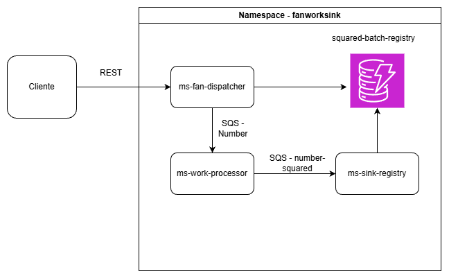

# Arquitectura - Namespace `fanworksink`

Este namespace agrupa los microservicios responsables de procesar, transformar y registrar lotes de números utilizando colas SQS y una base de datos DynamoDB.



---

##  Microservicios


### **ms-fan-dispatcher**
Encargado de generar un *batch* según las características deseadas del cliente y consultar los datos ordenados. 

**Ejemplos:**   
Colección de ejemplo: [Descargar colección](./PruebaINGPLATAFORMAS.postman_collection.json)


**Endpoints:**
- **POST `/create-batch`**  
  Crea un batch según el tamaño solicitado por el usuario.  
  **Ejemplo de petición:**
  ```json
  {
    "size": 10,
    "min": 1,
    "max": 100
  }

- **POST `/result`**  
    Obtiene los registros por archivo ordenado de menor a mayor y elevado al cuadrado.  
  **Ejemplo de petición:**
  ```json
   result?batchId=BATCH-20251106-174410-7cefca65

### **ms-worker-processor**
Encargado de obtener los números a través de una cola de entrada y procesarlos de manera concurrente, para posteriormente enviarlos a una cola de salida

### **ms-sink-registry**
Encargado de obtener los números ya procesados y almacenarlos para sus posterior recuperación


##  Ejecución

### **Pre-requisitos**:
- Docker (Para contenerización)
- Minikube (Para despliegue simulando un entorno real de producción)


### **Procedimiento**

Una vez se disponga de **Docker** y **Minikube**, se debe ejecutar el script adjunto [init.sh](./init.sh), el cual se encargará de preparar el entorno para la ejecución de la aplicación.  

El script realiza las siguientes acciones:

1. Construye las imágenes Docker de los tres microservicios.  
2. Despliega los manifiestos de Kubernetes correspondientes a los *Deployments*, *Services* y demás recursos necesarios.  
3. Crea las colas y bases de datos requeridas para el funcionamiento del sistema.  

Al finalizar este proceso, el entorno local quedará completamente configurado y la aplicación estará lista para ser utilizada.
